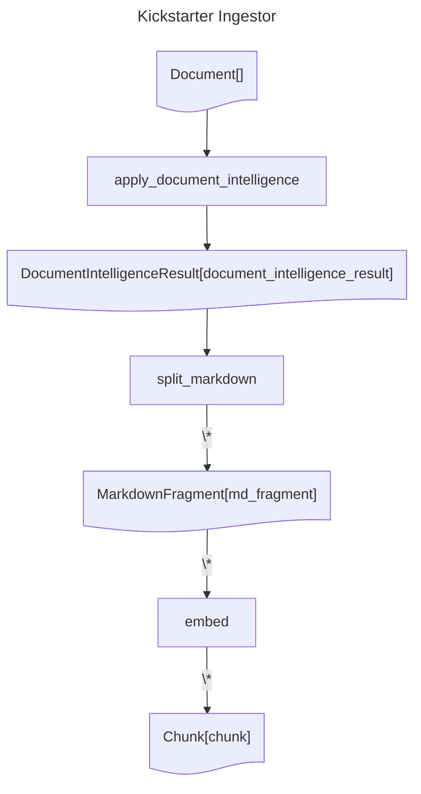

# Kickstarter Ingestor
## Diagram

## Operations documentation
### apply_document_intelligence


Apply Document Intelligence to the document and return a fragment with the result.
<details>
<summary>Code</summary>

```python
@catalyst.operation()
def apply_document_intelligence(
    document: Document,
) -> Annotated[DocumentIntelligenceResult, "document_intelligence_result"]:
    """
    Apply Document Intelligence to the document and return a fragment with the result.
    """
    poller = catalyst.document_intelligence_client.begin_analyze_document(
        model_id="prebuilt-layout",
        body=AnalyzeDocumentRequest(
            bytes_source=document.content,
        ),
        features=[
            DocumentAnalysisFeature.OCR_HIGH_RESOLUTION,
        ],
        output_content_format=DocumentContentFormat.Markdown,
    )
    return DocumentIntelligenceResult.with_source_result(
        document,
        label="document_intelligence_result",
        analyze_result=poller.result(),
    )

```

</details>

### split_markdown


1. Split the Markdown in the "document_intelligence_result" fragment into multiple fragments.
2. Create a new Markdown fragment for each split.
<details>
<summary>Code</summary>

```python
@catalyst.operation()
def split_markdown(
    document_intelligence_result: DocumentIntelligenceResult,
) -> Annotated[list[MarkdownFragment], "md_fragment"]:
    """
    1. Split the Markdown in the "document_intelligence_result" fragment into multiple fragments.
    2. Create a new Markdown fragment for each split.
    """
    from semantic_text_splitter import MarkdownSplitter

    MAX_CHARACTERS = 2000

    splitter = MarkdownSplitter(MAX_CHARACTERS, trim=False)

    figure_pattern = re.compile(r"<figure>.*?</figure>", re.DOTALL)
    page_break_pattern = re.compile(r"<!-- PageBreak -->")

    fragments = []
    page_nb = 1
    for i, chunk in enumerate(splitter.chunks(document_intelligence_result.content_as_str())):
        content = " ".join(figure_pattern.split(chunk))
        if page_break_pattern.match(content):
            page_nb += 1
        fragments.append(
            MarkdownFragment.with_source(
                document_intelligence_result,
                label="md_fragment",
                content=content,
                mime_type="text/markdown",
                human_index=i + 1,
                metadata={
                    "file_name": document_intelligence_result.metadata["file_name"],
                    "page_number": page_nb,
                },
            )
        )
    return fragments

```

</details>

### embed


For each figures or MD fragment create an chunk fragment
<details>
<summary>Code</summary>

```python
@catalyst.operation()
def embed(
    fragments: list[MarkdownFragment],
) -> Annotated[list[Chunk], "chunk"]:
    """
    For each figures or MD fragment create an chunk fragment
    """
    from az_ai.catalyst.helpers.azure_openai import create_embeddings

    return [
        create_embeddings(
            catalyst=catalyst,
            fragment=fragment,
            label="chunk",
            human_index=index + 1,
            model="text-embedding-3-small",
            metadata={
                "file_name": fragment.metadata["file_name"],
                "page_number": fragment.metadata["page_number"],
            },
        )
        for index, fragment in enumerate(fragments)
    ]

```

</details>
